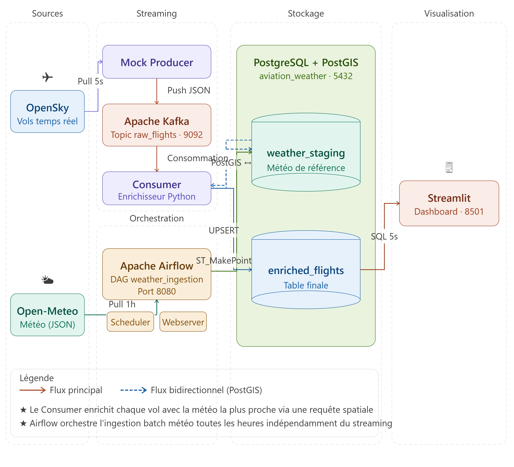

# Système d'Enrichissement de Flux Aériens en Temps Réel

## 1. Présentation du Projet et Cas d'Usage

Ce projet a été développé dans le cadre du module de ETL Pipeline & Orchestration. Il s'agit d'un pipeline complet de bout en bout (End-to-End) conçu pour ingérer, traiter et visualiser des données aéronautiques en temps réel, croisées avec des conditions météorologiques de surface.

L'intérêt métier :
Les conditions météorologiques (en particulier la vitesse et la direction du vent) ont un impact direct sur la consommation de carburant, la vitesse sol (Ground Speed) et la sécurité des aéronefs. L'objectif de ce système est de démontrer la capacité à croiser un flux de données continu à haute vélocité (positions GPS des avions) avec des données de référence (grilles météorologiques régionales) de manière quasi-instantanée, afin d'offrir aux contrôleurs ou aux analystes une vue consolidée de l'espace aérien.

## 2. Architecture Technique



Le système repose sur une architecture hybride intégrant des traitements Batch et Streaming, orchestrés au sein d'un environnement conteneurisé.

### 2.1. Sources de Données
* Trafic Aérien (Streaming) : OpenSky Network API (simulé via un Mock Producer pour des raisons de résilience face aux limites de requêtes de l'API publique) https://opensky-network.org/ .
* Météorologie (Batch) : Open-Meteo API.

### 2.2. Pipeline de Traitement
L'architecture est structurée autour de quatre couches principales :

1. Couche d'Ingestion et Streaming (Apache Kafka & Python) :
   * Un producteur Python extrait les données de vol en continu et les publie dans le topic Kafka `raw_flights`.
   * Le système gère l'envoi sous format JSON avec une fréquence d'actualisation de 5 secondes.

2. Couche d'Orchestration Batch (Apache Airflow) :
   * Un DAG (`weather_ingestion_batch`) planifié de manière horaire récupère les données météorologiques pour une grille de villes de référence.
   * Airflow se charge d'insérer ces données de référence dans la base de staging spatiale.

3. Couche de Stockage et d'Enrichissement Spatial (PostgreSQL + PostGIS) :
   * Base de données : `aviation_weather`.
   * Table `weather_staging` : Stocke la météo de référence. La position de chaque ville est convertie en géométrie spatiale via la fonction PostGIS `ST_MakePoint`.
   * Consommateur Python (L'Enrichisseur) : Ce composant critique lit le flux Kafka en continu. Pour chaque avion, il exécute une requête spatiale bidirectionnelle exploitant l'opérateur de distance géographique PostGIS (`<->`) pour identifier la station météorologique la plus proche.
   * Table `enriched_flights` : Reçoit le résultat consolidé (Avion + Météo). L'insertion utilise la clause `ON CONFLICT DO UPDATE` (UPSERT) pour maintenir une vue d'état (Snapshot) des positions actuelles sans duplication.

4. Couche de Visualisation (Streamlit) :
   * Un tableau de bord analytique interrogeant la base PostgreSQL.
   * Fournit des indicateurs clés de performance (KPIs), une cartographie interactive, et des analyses statistiques croisées.

## 3. Prérequis Système

Pour déployer cette infrastructure localement, les outils suivants sont requis :
* Docker et Docker Compose (version 3.8+)
* Python 3.9+
* Git

## 4. Instructions de Déploiement

Le guide de déploiement complet, étape par étape, est disponible dans le fichier `SETUP.md` à la racine de ce dépôt. Il contient toutes les commandes nécessaires pour initialiser l'infrastructure Docker, configurer Airflow et lancer le pipeline de streaming.

## 5. Structure du Dépôt

```text
.
├── dags/
│   └── weather_dag.py              # Pipeline batch Airflow (API Open-Meteo)
├── streaming/
│   ├── opensky_producer.py         # Producteur API réelle (Limité par quotas)
│   ├── opensky_mock_producer.py    # Producteur Mock (Déploiement soutenance/tests)
│   └── opensky_consumer.py         # Consommateur Kafka et jointure PostGIS
├── dashboard/
│   └── app.py                      # Application de visualisation Streamlit
├── docker-compose.yml              # Configuration de l'infrastructure
├── requirements.txt                # Dépendances Python
├── SETUP.md                        # Guide d'installation et de lancement
└── README.md                       # Documentation du projet

```
